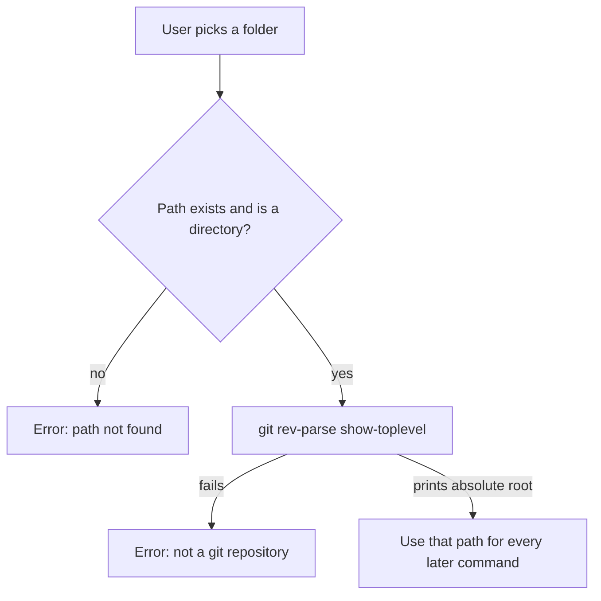
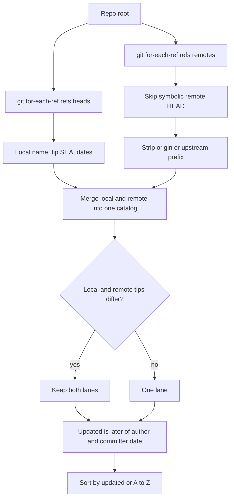
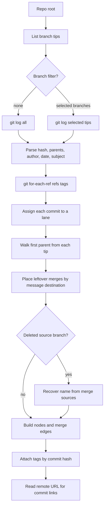
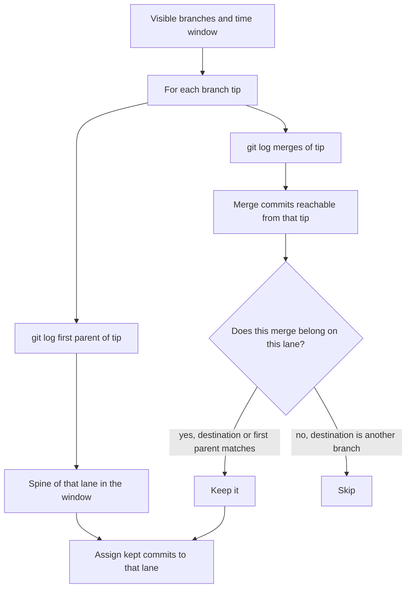
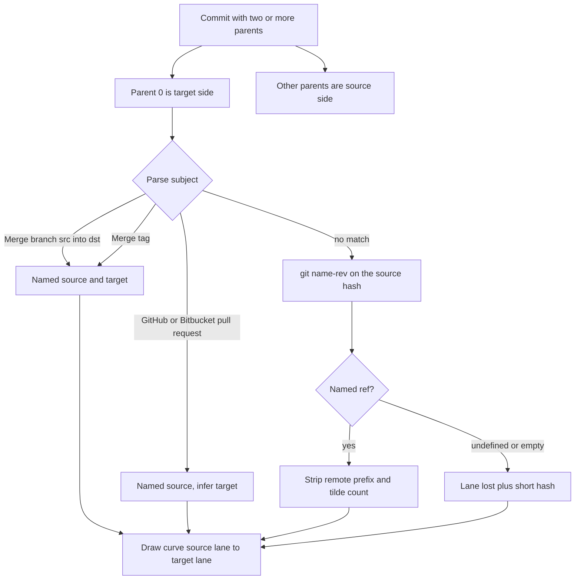
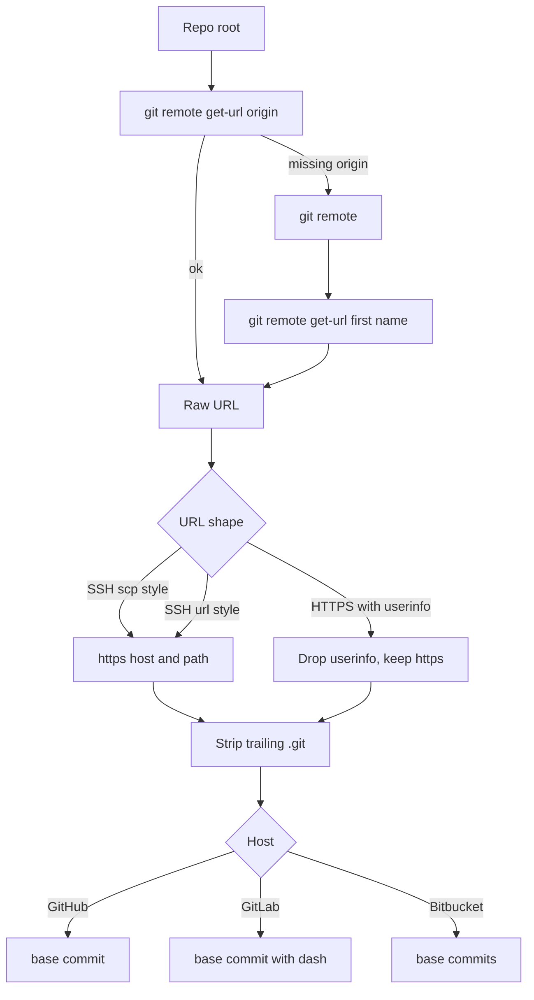
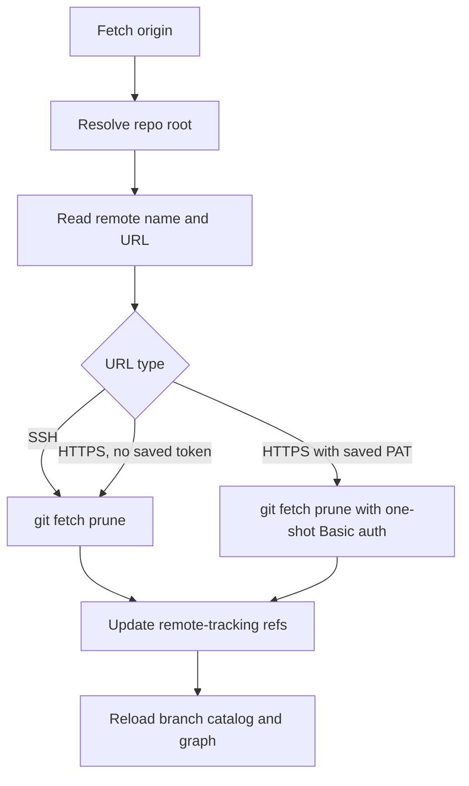

# Git commands

Git CLI used by the app: **full commands**, **arguments**, **output**, and **how each feature uses them**.

Every command is run with `-C` so the shell’s current directory does not matter:

```bash
git -C <repo> <command> ...
```

`<repo>` is the folder you picked, or the toplevel path from `rev-parse --show-toplevel`.

The working tree is never modified except by **fetch**, which only updates remote-tracking refs (`refs/remotes/*`).

---

## Global options

These flags come before the subcommand.

### `-C <path>`

```bash
git -C <path> <subcommand> ...
```

| Arg | Meaning |
|---|---|
| `-C <path>` | Run as if the current directory were `<path>`. Same as `cd <path> && git ...` without changing the shell cwd. |

Used on every command below.

### `-c <key>=<value>`

One-shot config for **this process only**. Does not write `.git/config` or `~/.gitconfig`.

| Arg | Meaning |
|---|---|
| `-c credential.helper=` | Disable credential helpers for this run so stored passwords do not override the header. |
| `-c http.extraHeader=Authorization: Basic <base64>` | Send HTTP Basic auth. `<base64>` is Base64 of `user:token` with no line wraps. |

---

## Feature: open a repository

Resolve the folder to a Git worktree root. Nothing else talks to Git until this succeeds.



**Logic:** a subdirectory such as `frontend/` still works; Git prints the real repo root. All later commands use that root.

```bash
git -C <path> rev-parse --show-toplevel
```

| Arg | Meaning |
|---|---|
| `rev-parse` | Parse revisions and repository identity. |
| `--show-toplevel` | Print the absolute working-tree root (the directory that contains `.git`, or the worktree root). |

**Output:** one line, e.g. `/home/you/project`.

---

## Feature: list branches

Build the branch catalog (names, tip hashes, last-updated). Used by the sidebar and as the starting set for the graph.



**Logic:** remote-tracking refs are local copies from a previous fetch — this step does not talk to the network. `origin/HEAD` is ignored. If `main` exists locally and `origin/main` points at the same commit, they collapse to one lane; if the tips differ, both stay visible.

```bash
git -C <repo> for-each-ref --format='%(refname:short)%00%(objectname)%00%(authordate:unix)%00%(committerdate:unix)' refs/heads
git -C <repo> for-each-ref --format='%(refname:short)%00%(objectname)%00%(authordate:unix)%00%(committerdate:unix)' refs/remotes
```

| Arg | Meaning |
|---|---|
| `for-each-ref` | Walk refs that match a pattern and print formatted fields. |
| `--format=...` | One record per ref. Fields below. |
| `refs/heads` | Local branches only. |
| `refs/remotes` | Remote-tracking branches (`origin/main`, …). |

**Format:**

| Placeholder | Field | Example |
|---|---|---|
| `%(refname:short)` | Short name | `main`, `origin/feature/login` |
| `%00` | NUL field separator | — |
| `%(objectname)` | Tip commit SHA | `a1b2c3d4…` |
| `%(authordate:unix)` | Author date, Unix seconds | `1710000000` |
| `%(committerdate:unix)` | Committer date, Unix seconds | `1710000100` |

**Output** (NUL shown as `|`):

```text
main|abc123…|1700000000|1700000000
feature/login|def456…|1700100000|1700100000
```

---

## Feature: load the graph

Plot commits on a time axis, one swimlane per branch, with merge/PR curves between lanes.

Two Git modes:

- **No time window** — one `log` covering the selected tips (or `--all`).
- **Time window** (pan/zoom) — per branch, `log --first-parent` plus `log --merges`. See [time window](#feature-time-window).



**Logic after `log`:**

1. Split each line on the unit-separator byte into hash, parents, author, ISO date, subject.
2. A commit with **two or more parents** is a merge. Parent 0 is the target branch; later parents are sources.
3. Walk first-parent from each tip and give unclaimed commits that lane. Feature branches claim before `main` / `master` / `develop` / `dev` / `trunk`, so the trunk does not steal feature history.
4. Merge subject text names source and target when possible (`Merge branch 'feature' into main`, GitHub PR, Bitbucket PR).
5. Exclusive commit count for a merge = commits reachable from the source parent but not from the target parent.
6. Nodes are placed by **author date**.

```bash
git -C <repo> log --pretty=format:%H%x1f%P%x1f%an%x1f%aI%x1f%s --all
git -C <repo> log --pretty=format:%H%x1f%P%x1f%an%x1f%aI%x1f%s <tip1> <tip2> ...
git -C <repo> for-each-ref --format='%(refname:short)%00%(*objectname)%00%(objectname)' refs/tags
```

**`log` pretty format:**

| Placeholder | Field | Notes |
|---|---|---|
| `%H` | Full commit hash | 40 hex characters |
| `%x1f` | ASCII Unit Separator (`0x1F`) | Unlikely in names or subjects |
| `%P` | Parent hashes, space-separated | Empty = root; two or more = merge |
| `%an` | Author name | Not the email |
| `%aI` | Author date, ISO-8601 | e.g. `2024-01-15T10:30:00+03:00` |
| `%s` | Subject (first line) | Parsed for merge/PR source and target |

`--pretty=format:` does not add a trailing newline after the last commit.

**`--all`** starts from every ref (local branches, remotes, tags, `HEAD`). **`<tip>…`** is used when the user picked a subset of branches; each tip is a **SHA**, not a branch name.

**Tag format:**

| Placeholder | Field | Notes |
|---|---|---|
| `%(refname:short)` | Tag name | `v1.0` |
| `%(*objectname)` | Peeled commit | Empty on lightweight tags; on annotated tags this is the commit, not the tag object |
| `%(objectname)` | The tag’s own object | Lightweight: the commit. Annotated: the tag object SHA |

Use `%(*objectname)` when it is non-empty; otherwise `%(objectname)`. Several tags on one commit are all attached.

---

## Feature: time window

Pan/zoom loads only commits inside a since/until range, one pair of `log` calls per visible branch.



**Logic:** `--first-parent` follows only parent 0 (the branch you merged **into**). That misses some merges such as `Merge branch 'dev' of remote into dev`, which are not on the spine. `--merges` collects those; a merge is kept only if its subject destination matches this lane, its first parent is already on this lane, or it looks like a GitHub/Bitbucket PR.

`--since` / `--until` are omitted when that bound is unset. Dates are ISO-8601 / RFC3339, e.g. `2024-01-01T00:00:00Z`.

```bash
git -C <repo> log --pretty=format:%H%x1f%P%x1f%an%x1f%aI%x1f%s --first-parent <tip> --since=<RFC3339> --until=<RFC3339>
git -C <repo> log --pretty=format:%H%x1f%P%x1f%an%x1f%aI%x1f%s --merges <tip> --since=<RFC3339> --until=<RFC3339>
```

| Arg | Meaning |
|---|---|
| `--first-parent` | Follow only parent 0. Walks the branch spine, not every commit brought in from the other side. |
| `--merges` | Only commits with two or more parents. |
| `<tip>` | SHA of that branch’s tip. |
| `--since=<time>` | Commits at or after this instant. |
| `--until=<time>` | Commits at or before this instant. |

Same pretty format as the full `log` above.

---

## Feature: merge and PR flow

Git only supplies parents and the subject line. Source/target lane names come from that text, then from refs, then from a fallback.



**Logic:**

- Same source and target → a loop on that lane.
- GitHub (`Merge pull request #N from …`) and Bitbucket (`Merged in … (pull request #N)`) subjects are classified as **PR**. Destination is inferred from other lanes the commit sits on (prefer `dev` / `develop` / `main` / `master` / `trunk`).
- `name-rev` runs only for source hashes whose subject did **not** already name a branch. It is skipped when the user filtered to a subset of branches.
- If the recovered name is already a known lane, that lane is walked from the source hash. If the name would collide with an existing lane but came from `name-rev` rather than the message, the fallback `lost/<7-char-hash>` is used instead.

```bash
git -C <repo> name-rev --name-only --stdin
```

**Stdin** — one hash per line:

```text
<hash1>
<hash2>
```

| Arg | Meaning |
|---|---|
| `name-rev` | Human-readable name for a commit (nearest ref plus `~N` / `^N`). |
| `--name-only` | Print only the name. Lines match stdin order. |
| `--stdin` | Read hashes from stdin instead of the command line. |

**Output example:**

```text
origin/feature/login
main~3
undefined
```

Name cleanup: strip `refs/heads/`, `refs/remotes/`, `refs/tags/`, `remotes/`, `tags/`; strip trailing `~N` / `^N`; strip a leading `origin/` or `upstream/`; treat `undefined` as unnamed.

---

## Feature: remote URL and commit links

Read the configured remote (no network) and turn it into a browser URL.



**Logic:** the prefix is stored once; the UI appends the commit hash. Tokens in the URL are stripped so they never appear in a link.

```bash
git -C <repo> remote get-url origin
git -C <repo> remote
git -C <repo> remote get-url <name>
```

| Arg | Meaning |
|---|---|
| `remote` | With no subcommand: print remote **names**, one per line. |
| `get-url` | Print the fetch URL from `.git/config`. |
| `origin` / `<name>` | Remote to read. Fallback is the first name from `git remote`. |

**Output:** `git@github.com:acme/repo.git` or `https://github.com/acme/repo.git`.

---

## Feature: fetch

The only command that talks to the server. Updates `refs/remotes/*` only — no merge, rebase, or working-tree change. After it succeeds, the branch list and graph reload.



**Logic:** SSH uses your keys. HTTPS without a token uses Git Credential Manager (or whatever Git would use normally). A saved PAT is sent as HTTP Basic for this process only; it is **not** written into the repo.

Token usernames:

| Host | Username in `user:token` |
|---|---|
| GitLab | `oauth2` |
| Bitbucket | `x-token-auth` |
| GitHub and others | `x-access-token` |

```bash
git -C <repo> fetch --prune <remote>
git -C <repo> -c credential.helper= -c http.extraHeader='Authorization: Basic <base64>' fetch --prune <remote>
```

| Arg | Meaning |
|---|---|
| `fetch` | Download objects and update `refs/remotes/<remote>/*`. |
| `--prune` | Delete stale remote-tracking refs for branches removed on the server. |
| `<remote>` | Usually `origin`; otherwise the first remote. |

---

## Command index

| Full command | Writes | Network |
|---|---|---|
| `git -C <path> rev-parse --show-toplevel` | no | no |
| `git -C <repo> for-each-ref --format='%(refname:short)%00%(objectname)%00%(authordate:unix)%00%(committerdate:unix)' refs/heads` | no | no |
| `git -C <repo> for-each-ref --format='%(refname:short)%00%(objectname)%00%(authordate:unix)%00%(committerdate:unix)' refs/remotes` | no | no |
| `git -C <repo> for-each-ref --format='%(refname:short)%00%(*objectname)%00%(objectname)' refs/tags` | no | no |
| `git -C <repo> log --pretty=format:%H%x1f%P%x1f%an%x1f%aI%x1f%s --all` | no | no |
| `git -C <repo> log --pretty=format:%H%x1f%P%x1f%an%x1f%aI%x1f%s <tips...>` | no | no |
| `git -C <repo> log --pretty=format:%H%x1f%P%x1f%an%x1f%aI%x1f%s --first-parent <tip> [--since=...] [--until=...]` | no | no |
| `git -C <repo> log --pretty=format:%H%x1f%P%x1f%an%x1f%aI%x1f%s --merges <tip> [--since=...] [--until=...]` | no | no |
| `git -C <repo> name-rev --name-only --stdin` | no | no |
| `git -C <repo> remote get-url origin` | no | no |
| `git -C <repo> remote` | no | no |
| `git -C <repo> remote get-url <name>` | no | no |
| `git -C <repo> fetch --prune <remote>` | remote-tracking refs only | yes |
| `git -C <repo> -c credential.helper= -c http.extraHeader='Authorization: Basic <base64>' fetch --prune <remote>` | remote-tracking refs only | yes |
