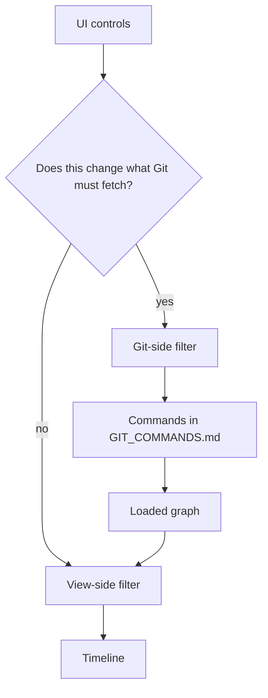
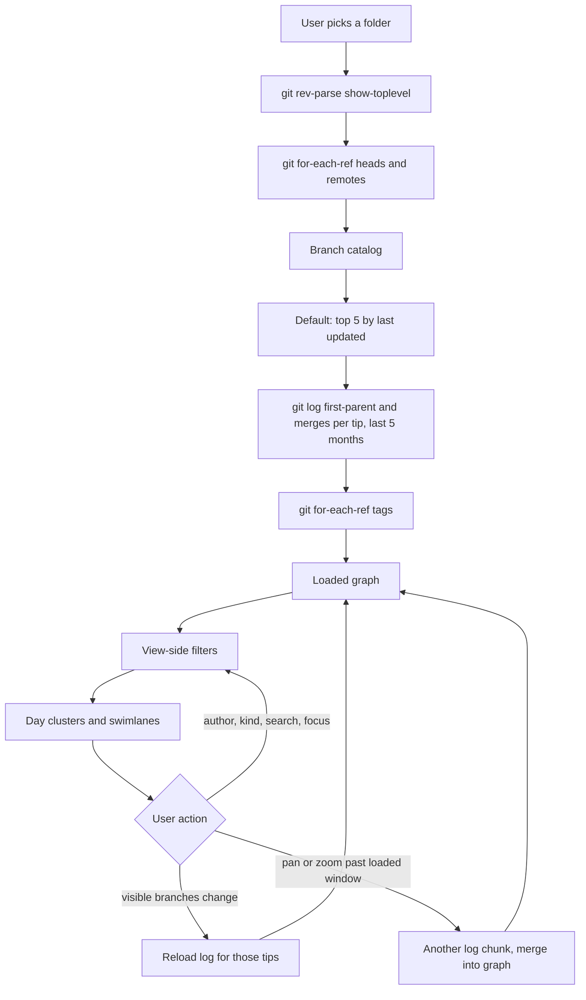
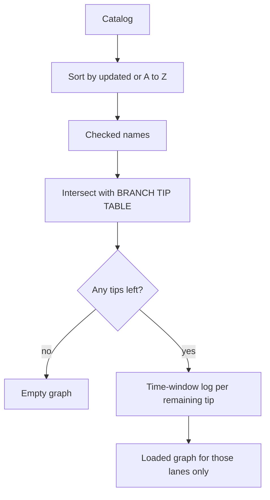
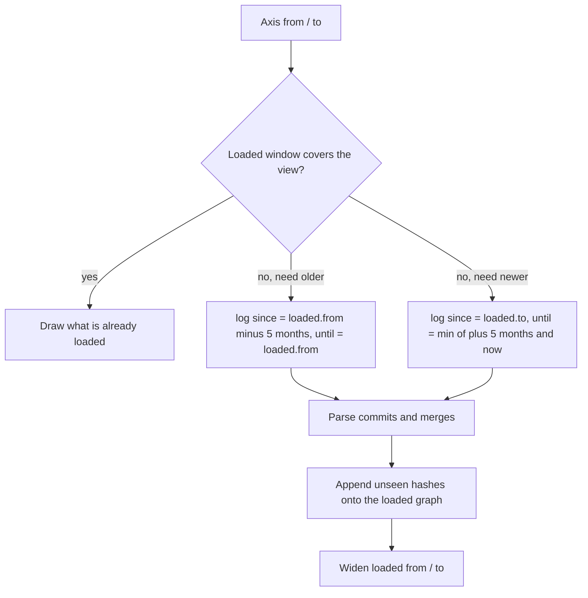
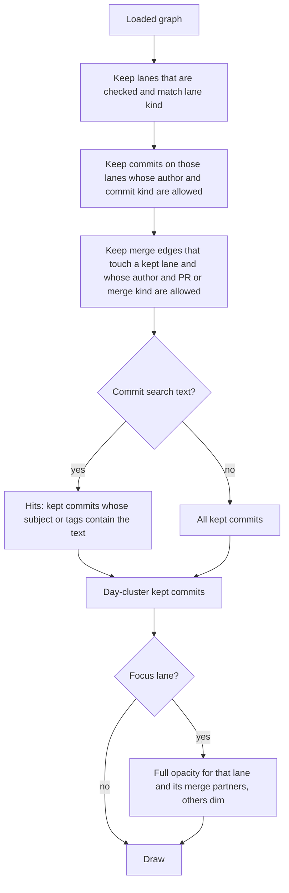
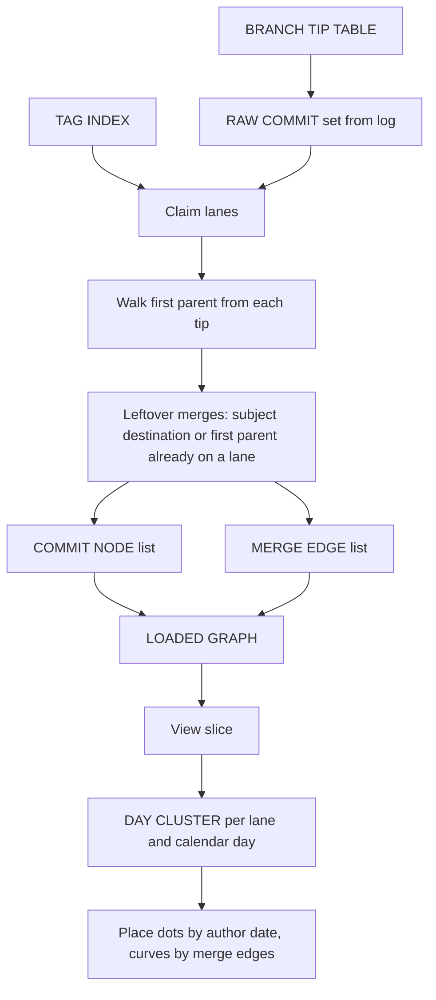

# UI filters and the graph

How the timeline filters drive the Git commands in [GIT_COMMANDS.md](GIT_COMMANDS.md), and the records the graph is built from.

Filters are **not** all the same. Some change which Git commands run. Others only hide rows that are already loaded.



| Layer | What it changes | Reloads Git? |
|---|---|---|
| Git-side | Which branch tips and time window `log` walks | Yes |
| View-side | Which loaded commits, merges, and lanes are drawn | No |

---

## End-to-end

Opening a repo, changing visible branches, and panning the axis all go through Git. Author, kind, search, and focus do not.



**Logic:** the catalog is the full branch list. The loaded graph is only the checked tips, inside the time windows that have been requested so far. The timeline never sees more than the view-side slice of that graph.

---

## Data the graph needs

Language-agnostic records. Names are roles, not types.

### Branch catalog entry

Built by **list branches** (`for-each-ref` on `refs/heads` and `refs/remotes`). The sidebar and the default visible set come from this, not from `log`.

```text
BRANCH CATALOG ENTRY
  name     — short lane name  (origin/ and upstream/ stripped when they match a local name)
  tip      — commit hash the ref points at
  updated  — later of author date and committer date on that tip
```

Many refs can collapse to one catalog name. If `main` and `origin/main` share a tip, one entry. If the tips differ, both stay.

### Branch tip table

What **load the graph** actually walks. Keys are catalog names; values are tip hashes. Git `log` is given **hashes**, not branch names.

```text
BRANCH TIP TABLE
  name → tip hash

  example
    main           → abc123…
    feature/login  → def456…
    origin/main    → fed321…   (only if that tip differs from local main)
```

A **visible-branch** change rebuilds this table: keep only the checked names, then run `log` on those hashes.

### Raw commit

One row from `log` pretty format (`hash`, parents, author, ISO date, subject). Used while assigning lanes; not drawn as-is.

```text
RAW COMMIT
  hash      — full commit id
  parents   — list of parent hashes
                empty        = root
                one          = ordinary commit
                two or more  = merge; parent 0 is the target side
  author    — author name
  when      — author date
  subject   — first line of the message
  lane      — swimlane this commit was claimed by (filled after log)
  on lanes  — every lane that reached this commit in a time-window load
```

### Tag index

From **load the graph** (`for-each-ref refs/tags`). Several tags may share one hash.

```text
TAG INDEX
  commit hash → list of tag names
```

### Loaded graph

The payload the UI keeps. Every later view filter is a slice of this.

```text
LOADED GRAPH
  repo path
  commit link prefix     — host URL with no hash yet
  lanes                  — branch names that have at least one assigned commit
  commits                — list of COMMIT NODE
  merges                 — list of MERGE EDGE
```

### Commit node

A raw commit after lane assignment and tag attach. This is what a dot on a swimlane represents (before day clustering).

```text
COMMIT NODE
  hash
  lane        — swimlane name
  when        — author date (placement on the time axis)
  author
  subject
  is merge    — yes if two or more parents
  tags        — names from the tag index, or empty
```

### Merge edge

One curve (or loop) from a source lane to a target lane. Git does not store lane names; they come from the subject, then from refs, then from a fallback — see **merge and PR flow** in [GIT_COMMANDS.md](GIT_COMMANDS.md).

```text
MERGE EDGE
  hash           — the merge commit
  source lane
  target lane
  source hash    — parent that is not parent 0
  when
  author
  subject        — used to classify PR vs merge
  exclusive count — commits reachable from the source parent but not from the target parent
```

Same source and target → a loop on that lane.

### Day cluster

View-only. Commits on the **same lane and calendar day** become one node so the axis stays readable.

```text
DAY CLUSTER
  lane
  day
  count          — how many commits that day (badge; 99+)
  commits        — those COMMIT NODEs, earliest first
  when           — latest commit’s time (dot position)
  subject/author — from that latest commit
  is merge       — yes if any member is a merge
  tags           — union of member tags
```

### Loaded window

Remembers which Git time range is already in the loaded graph, so pan/zoom can fetch **chunks** instead of the whole history.

```text
LOADED WINDOW
  branch set     — the visible tips this window belongs to
  from, to       — earliest and latest instant already requested
  past done      — stop walking further back (three empty chunks)
  future done    — stop walking toward now
```

Changing the visible branch set **discards** this window and loads again.

### Filter state

What the UI holds. Only the first two rows are sent to Git.

```text
FILTER STATE
  visible lanes     — checked names; Git-side
  time window       — axis from/to; Git-side
  sort              — last updated or A–Z; catalog only
  branch search     — narrows the sidebar list
  focus lane        — dim unrelated lanes
  authors           — allowed author names; view-side
  commit kinds      — PR / merge / normal; view-side
  lane kinds        — feature / hotfix / epic / others; view-side
  tag labels        — show tag names under commit dots; view-side
  commit search     — subject or tag text; view-side
```

---

## Git-side filters

These change the arguments of commands in [GIT_COMMANDS.md](GIT_COMMANDS.md).

### Visible branches

Checkboxes, the top-N slider, All, and None.

Default after open: **top 5** of the catalog sorted by `updated`.



**Commands**

| User control | Command | What changes |
|---|---|---|
| Open repo / Fetch / Load | `for-each-ref refs/heads` and `refs/remotes` | Rebuilds the catalog |
| Checked branches | `log --first-parent <tip> --since --until` and `log --merges <tip> --since --until` | `<tip>` is each checked branch’s hash |
| None checked | no `log` | Empty graph, catalog stays |

Unchecked branches are **not** in the loaded graph. Focus, author, and kind filters cannot show them later.

`name-rev` (deleted source names) is skipped when the user has filtered to a subset of branches. Recovered names still come from merge subjects when those subjects name a branch.

### Time window

The axis starts at **now minus 5 months** (at least 7 days). Scroll zooms, drag pans, double-click resets.

Git is not given the visible pixel range on every frame. The UI asks for history in **5-month chunks** until the loaded window covers the view (or three empty chunks in that direction).



**Commands** — same pair as **time window** in [GIT_COMMANDS.md](GIT_COMMANDS.md):

```text
log --first-parent <tip> --since=<from> --until=<to>
log --merges <tip> --since=<from> --until=<to>
```

`--since` / `--until` omitted only when that bound is unset. Dates are ISO-8601.

Chunks are merged by identity:

- commit: same `hash`
- merge: same `hash` + `source hash`
- lane: name not already in the list

Authors discovered in a new chunk are added to the author catalog; they start **allowed**.

### Refresh and fetch

| Control | Git | Graph |
|---|---|---|
| Refresh | Same visible tips and current loaded window | Replaces the graph; catalog unchanged |
| Fetch origin | `fetch --prune`, then catalog + graph as on first open | Remote-tracking refs update; top-5 default applies again |

---

## View-side filters

These run **after** the loaded graph exists. They do not add `--author`, `--grep`, or extra `log` arguments.



A merge is kept if **either** its source or its target lane is still shown. The curve is only drawn when **both** lanes are shown; otherwise the merge can still sit on the remaining lane as a merge dot.

### Lane kind

Name prefix after stripping `origin/` / `upstream/`:

| Kind | Name matches |
|---|---|
| Feature | `feature/…`, `feat/…`, or those words as the whole name |
| Hotfix | `hotfix/…` or `hotfix` |
| Epic | `epic/…` or `epic` |
| Others | everything else (`main`, `develop`, `release/…`, …) |

This hides lanes that are already loaded. It does **not** skip their `log` calls. Unchecking a lane in **visible branches** is what stops Git from walking that tip.

### Commit kind

Taken from the commit / merge subject, not from Git notes.

| Kind | Rule |
|---|---|
| Normal | not a merge (one parent or root) |
| Merge | two or more parents, subject is not a PR pattern |
| PR | subject like `Merge pull request #N from …` or `Merged in … (pull request #N)` |

### Authors

The author list is the distinct `author` fields on loaded commit nodes. Toggle, All, None, and the author search box only change who is allowed in the view slice.

An empty allowed set draws no commits and no merges.

### Branch search and focus

| Control | Git | Effect |
|---|---|---|
| Search branches | none | Filters the sidebar list. A unique match (or an exact name) highlights that lane |
| Click a lane name | none | **Focus**: that lane and every lane connected by a kept merge edge stay bright; the rest dim to ~12% |
| Clear highlight | none | Drops focus and the search text |

Focus never loads extra history. A dimmed lane is still in the loaded graph.

### Commit search

Matches **subject** or **tag** on the view-sliced commits, newest first. Next / previous (Enter / Shift+Enter) jumps the axis to that hash and opens the inspector (a day cluster if that lane has more than one commit that calendar day).

### Tagged

One checkbox in the commit-kind section of the filter menu, right below PR / Merge / Normal — but it does not hide anything. It only toggles the tag labels drawn under the commit dots on the swimlanes: checked (default) draws the tag names, unchecked removes them. No Git calls, and no commits, merges, or lanes are filtered.

---

## From Git output to swimlanes

How the records above are filled. Command details stay in [GIT_COMMANDS.md](GIT_COMMANDS.md).



**Claim order:** feature-like lanes take unclaimed first-parent history before `main` / `master` / `develop` / `dev` / `trunk`, so the trunk does not swallow feature commits.

**Placement:** x = author date, y = lane index. Merges are Bézier curves from source cluster to target cluster; missing source cluster with a named source lane still draws a stub toward that lane.

---

## Which filter hits which command

| UI control | Git-side? | Commands | Records it changes |
|---|---|---|---|
| Open folder | yes | `rev-parse --show-toplevel` | repo path |
| Load / Fetch | yes | `for-each-ref` heads + remotes; then time-window `log`; `for-each-ref` tags; `remote get-url` | catalog, tip table, loaded graph |
| Visible branches (check, top N, All, None) | yes | time-window `log` on the remaining tips | tip table, loaded graph, loaded window |
| Pan / zoom / reset axis | yes, when the view leaves the loaded window | another `log --first-parent` + `log --merges` chunk | append commits/merges, widen loaded window |
| Sort updated / A–Z | no | — | order of the catalog and of “top N” |
| Search branches | no | — | sidebar list, highlight |
| Focus lane | no | — | opacity |
| Authors | no | — | view slice of commits and merges |
| PR / Merge / Normal | no | — | view slice |
| Feature / Hotfix / Epic / Others | no | — | which loaded lanes are drawn |
| Search commits | no | — | hit list, inspector, jump |
| Tagged | no | — | tag labels under commit dots |
| Refresh | yes | same `log` window as now | replace loaded graph |
| Fetch | yes | `fetch --prune`, then catalog + graph as on open | catalog and graph |

`name-rev` still runs only for unnamed merge sources when the graph is **not** restricted to a branch subset. Visible-branch filtering is that restriction.

---

## What the header counts

The badges are the **view slice**, not the catalog and not the full loaded graph.

```text
shown lanes / catalog size
merge edges that survived the view slice
commit nodes that survived the view slice
```

Day clustering does not change the commit count; it only changes how many dots are drawn.
